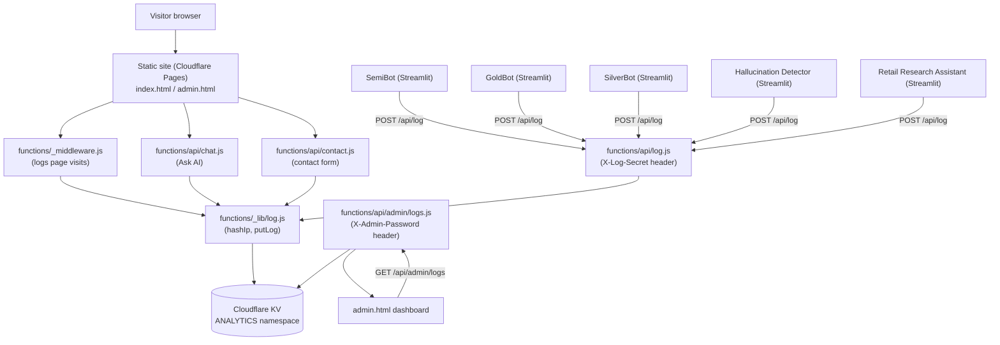

# Portfolio-Raj

Personal portfolio site for Raj Khatik — MSc Applied AI candidate, University of Warwick (WMG) — showcasing his agentic AI / GenAI projects (SemiBot, GoldBot, SilverBot, Hallucination Detector, HITL Email Agent, Retail Research Assistant), published research, dissertation, and a chat assistant grounded in the site's own content.

**Live site:** https://portfolio-raj.pages.dev

## Stack

- Vanilla HTML / CSS / JS — no framework (`index.html`, `css/style.css`, `js/main.js`, `js/chat.js`)
- [Cloudflare Pages](https://pages.cloudflare.com/) — static hosting
- [Cloudflare Pages Functions](https://developers.cloudflare.com/pages/functions/) — serverless backend (`functions/`)
- [Cloudflare KV](https://developers.cloudflare.com/kv/) — shared analytics/log store (binding `ANALYTICS`, see `wrangler.toml`)

## Architecture

- `index.html` / `admin.html` — the public single-page site and a private, password-gated analytics dashboard (not linked publicly)
- `functions/_middleware.js` — logs every real page view (GET requests, skipping `/api/*`, `/admin`, and static assets) to KV as a `visit` record
- `functions/api/chat.js` — the "Ask AI" endpoint: builds a system prompt from `functions/_lib/knowledge.js` (a curated knowledge doc) plus `functions/_lib/livePage.js` (a live scrape of `index.html` as a fallback source of truth), calls OpenAI, and logs the exchange to KV
- `functions/api/contact.js` — logs contact form submissions to KV; actual email delivery happens client-side to Web3Forms
- `functions/api/log.js` — a public logging endpoint, authenticated with a shared `X-Log-Secret` header, that the five external Streamlit apps (SemiBot, GoldBot, SilverBot, Hallucination Detector, Retail Research Assistant) POST visit/search/chat events to server-to-server, so everything lands in one shared analytics store
- `functions/api/admin/logs.js` — reads logs back out of KV for `admin.html`, authenticated via an `X-Admin-Password` header
- `functions/_lib/log.js` — shared helpers (`hashIp`, `putLog`) used by every endpoint above to write consistent, IP-hashed records into KV with a 180-day TTL

## Deploy

`npm run deploy` runs `wrangler pages deploy .` to publish to Cloudflare Pages.

There is **no** GitHub-to-Cloudflare webhook configured — pushing to `main` does **not** deploy the live site. Deploys must be triggered explicitly by running `npm run deploy` (which also regenerates `last-updated.json` via the `predeploy` script beforehand).
